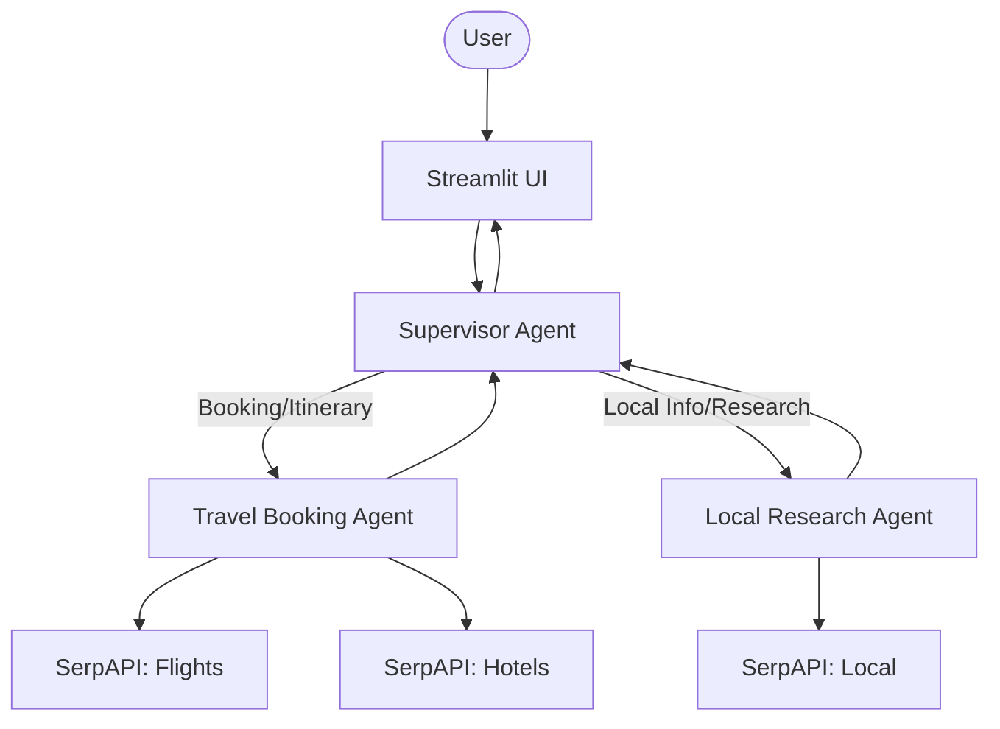

# I Multi-Agent Travel Planner

A multi-agent AI travel assistant that plans entire trips — flights, stays, places, and routes — in one conversation.

---

## 📌 Overview

Planning a trip usually involves juggling multiple platforms for flights, hotels, and local research. This project solves that by combining everything into a single AI-driven system.

It is a multi-agent travel planner that enables users to plan trips using natural language. From finding flights and hotels to discovering attractions and generating routes, everything is handled through a single conversational interface, where specialized agents collaborate to produce a unified travel plan.

---

## ✨ Key Features

- Natural language trip planning
- Multi-agent architecture with task specialization
- Flight and hotel search using real-time data
- Local attractions and restaurant discovery
- Route planning between locations (maps integration)
- Streamlit-based interactive UI
- CLI interface for testing and debugging
- Observability with detailed execution logs

---

## 🧠 Architecture



### Agent Workflow

- **Supervisor Agent**: Routes user queries to the appropriate agent
- **Booking Agent**: Handles flights, hotels, and itinerary planning
- **Research Agent**: Handles local discovery (restaurants, attractions) and routes
- **Tool Nodes**: Execute API calls via SerpAPI

The system is implemented using a LangGraph state machine where agents and tools interact dynamically based on user intent.

---

## 🛠️ Tech Stack

- Python
- LangGraph (multi-agent orchestration)
- Google Gemini (LLM)
- SerpAPI (Flights, Hotels, Local search)
- Streamlit (Frontend UI)
- Rich + Prompt Toolkit (CLI interface)

---

## 📂 Project Structure

- [agent.py](./agent.py) — Builds the LangGraph multi-agent workflow
- [app.py](./app.py) — Streamlit frontend UI
- [main.py](./main.py) — CLI interface for testing
- [tools.py](./tools.py) — SerpAPI tool integrations
- [logger.py](./logger.py) — Logging and observability system
- [state.py](./state.py) — Graph state and schema definitions
- [styles.css](./styles.css) — Custom CSS styling for the Streamlit UI
- [pyproject.toml](./pyproject.toml) — Project dependencies and metadata configuration
- [serpapi_schemas/](./serpapi_schemas/) — JSON schemas for [amenities](./serpapi_schemas/google-hotels-amenities.json) and [property types](./serpapi_schemas/google-hotels-property-types.json)
- [prompts/](./prompts/) — Agent prompt definitions ([Booking](./prompts/booking_agent.md), [Research](./prompts/research_agent.md), [Supervisor](./prompts/supervisor.md))

---

## ⚙️ Installation & Setup

### 1. Clone the repository

```bash
git clone https://github.com/Subhankar03/Travel-Planner.git
cd Travel-Planner
```

### 2. Install dependencies (using uv)

```bash
uv sync
```

> `uv` automatically manages the virtual environment, so you don’t need to create one manually.

### 3. Setup environment variables

Create a `.env` file in the root directory:

```env
SERPAPI_KEY=your_serpapi_key
GOOGLE_API_KEY=your_gemini_api_key
```

---

## ▶️ Usage

### Run Streamlit App

```bash
uv run streamlit run app.py
```

### Run CLI Interface

```bash
uv run main.py
```

---

## 💬 Example Prompts

- "Plan a 5-day trip from Kolkata to Goa next month with a total budget under ₹25,000. Find the cheapest flights (layovers are fine) and suggest budget-friendly hotels near popular beaches. Also include a simple day-wise itinerary with must-visit spots."
- "I’m visiting Jaipur for 3 days with my family and want premium accommodation. Find highly rated 5-star hotels and suggest nearby attractions, including forts, cultural spots, and good restaurants for authentic Rajasthani food."
- "I’ll be in Bangalore for a weekend and want to explore the city. Suggest top-rated cafes, coworking-friendly spots, and popular tourist attractions, along with a rough plan to cover them efficiently."
- "Plan a luxury weekend trip from Mumbai to Kochi for a couple. Find business class or premium flights, recommend top-tier resorts, and suggest romantic experiences like fine dining or backwater cruises with a detailed itinerary."

---

## 📊 Output Capabilities

The system generates:

- Flight options with pricing and booking links
- Hotel recommendations with amenities and images
- Local attractions, restaurants, and reviews
- Structured itinerary suggestions
- Route guidance between locations (maps integration)

---

## 🔌 APIs Used

- SerpAPI (Google Flights, Hotels, Local Search)
- Google Gemini (LLM reasoning and agent coordination)

---

## 📈 Observability

The system includes a logging module that tracks:

- User queries
- Agent decisions
- Tool calls and outputs
- Final AI responses

Logs are stored per day and automatically cleaned up after 7 days.

---

## 🚧 Limitations

- Depends on external APIs (rate limits and latency)
- Pricing data may not always be real-time accurate
- Limited personalization without long-term memory

---

## 🔮 Future Improvements

- Real-time booking integration
- Persistent memory for personalized recommendations
- Advanced itinerary optimization
- Improved route visualization and map interactions

---

## 📜 License

MIT License

---

## 🤝 Contributing

Contributions are welcome! Feel free to open issues or submit pull requests.
