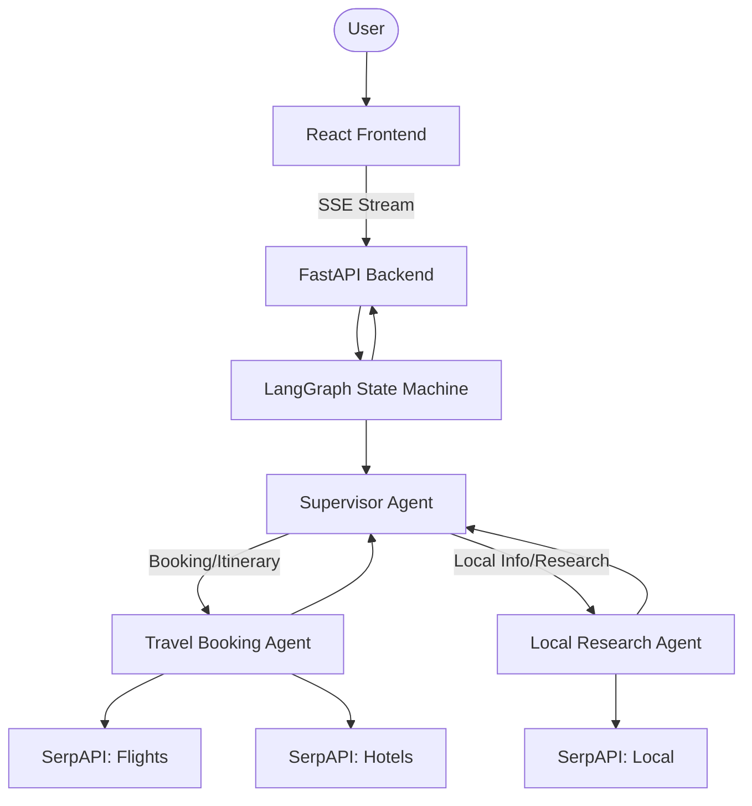

# ✈️ Multi-Agent Travel Planner

A multi-agent AI travel assistant that plans entire trips — flights, stays, places, and routes — in one conversation.

---

## 📌 Overview

Planning a trip usually involves juggling multiple platforms for flights, hotels, and local research. This project solves that by combining everything into a single AI-driven system.

It is a multi-agent travel planner that enables users to plan trips using natural language. From finding flights and hotels to discovering attractions and generating routes, everything is handled through a single conversational interface, where specialized agents collaborate to produce a unified travel plan.

---

## ✨ Key Features

- **Natural language trip planning** via a sleek React Copilot interface
- **Multi-agent architecture** with task specialization via LangGraph
- **Flight and hotel search** using real-time data seamlessly pushed to the UI
- **Local attractions and restaurant discovery** natively linked to geolocation
- **FastAPI Backend** exposing a responsive, asynchronous API
- **Real-time Streaming** via the Vercel AI SDK (`x-vercel-ai-ui-message-stream: v1`) protocol over SSE
- **Dynamic Results Panel** visualizing flights, hotels, and places as interactive cards
- **Smart Formatting** rendering AI markdown natively, mapping tool call status dynamically
- **Observability** with detailed execution logs

---

## 🧠 Architecture


```mermaid
flowchart TD
    User([User]) --> Frontend[React Frontend]
    Frontend -->|SSE Stream| FastAPI[FastAPI Backend]
    FastAPI --> LangGraph[LangGraph State Machine]
    LangGraph --> Supervisor[Supervisor Agent]
  
    Supervisor -->|Booking/Itinerary| Booking[Travel Booking Agent]
    Supervisor -->|Local Info/Research| Research[Local Research Agent]
  
    Booking --> SerpFlights[SerpAPI: Flights]
    Booking --> SerpHotels[SerpAPI: Hotels]
  
    Research --> SerpLocal[SerpAPI: Local]
  
    Booking --> Supervisor
    Research --> Supervisor
    LangGraph --> FastAPI
```

### Agent Workflow

- **Supervisor Agent**: Routes user queries to the appropriate specialized agent.
- **Booking Agent**: Handles flights, hotels, and itinerary planning.
- **Research Agent**: Handles local discovery (restaurants, attractions, routes).
- **Tool Nodes**: Execute remote API calls via SerpAPI.
- **Checkpointer**: Uses `MemorySaver` to persist conversation histories for the lifespan of the server process.

---

## 🛠️ Tech Stack

### Frontend
- **Framework**: React 19, Vite
- **Styling**: Tailwind CSS v4, Lucide React (Icons)
- **Streaming Logic**: `@microsoft/fetch-event-source`
- **Markdown Handling**: `react-markdown`, `remark-gfm`, `@tailwindcss/typography`

### Backend
- **Core logic**: Python, LangGraph, `MemorySaver` checkpointer
- **LLM**: Google Gemini
- **Tools**: SerpAPI (Flights, Hotels, Local search), Google Maps
- **Server**: FastAPI, Uvicorn

---

## 📂 Project Structure

- `backend/` — All server-side API logic
  - `server.py` — Main FastAPI application serving `/api/chat`
  - `agent.py` — LangGraph multi-agent workflow definition
  - `state.py` — Graph state and schema definitions
  - `tools.py` — SerpAPI & Google Maps tool integrations
  - `routes/chat.py` — Chat endpoint handling HTTP streaming
  - `core/graph.py` — Compiles the LangGraph state machine lazily
  - `core/stream_formatter.py` — Translates LangGraph `astream` events into Vercel AI SDK SSE parts
  - `prompts/` — Markdown-based system prompts for each agent
- `frontend/` — The React UI
  - `src/components/` — React UI components (ChatPanel, ResultsPanel, LandingHero, CopilotLayout)
  - `src/hooks/useGlideTripChat.ts` — Core SSE parsing and state orchestration hook
  - `src/index.css` — Tailwind v4 configuration and design token themes
  - `vite.config.ts` — Vite bundler configuration
- `app.py` — Legacy Streamlit frontend UI (V1 prototype)
- `logger.py` — Logging and observability system
- `pyproject.toml` — Python backend dependencies managed by `uv`

---

## ⚙️ Installation & Setup

### 1. Clone the repository

```bash
git clone https://github.com/Subhankar03/Travel-Planner.git
cd Travel-Planner
```

### 2. Set up Backend (using uv)

```bash
uv sync
```
*Note: `uv` automatically manages the virtual environment and resolves dependencies seamlessly.*

### 3. Set up Frontend (using npm)

```bash
cd frontend
npm install
```

### 4. Setup environment variables

Create a `.env` file in the root directory:

```env
SERPAPI_KEY=your_serpapi_key
GOOGLE_API_KEY=your_gemini_api_key
GOOGLE_MAPS_API_KEY=your_google_maps_api_key
# OPTIONAL: Use Vertex AI Instead
GOOGLE_GENAI_USE_VERTEXAI=true
GOOGLE_CLOUD_PROJECT=your_project
GOOGLE_CLOUD_LOCATION=global
```

---

## ▶️ Usage

To run the application end-to-end, you need to start both the Python backend and the React frontend.

### 1. Run the FastAPI Backend
Start the high-performance async API server:
```bash
uv run uvicorn backend.server:app --host 0.0.0.0 --port 8000 --reload
```

### 2. Run the React Frontend
In a new terminal window, start the Vite development server:
```bash
cd frontend
npm run dev
```

Visit `http://localhost:5173` in your browser. The app will ask for location permissions to intelligently tailor the trip origin!

---

## 💬 Example Prompts

- "Plan a 5-day trip from Kolkata to Goa next month with a total budget under ₹25,000. Find the cheapest flights (layovers are fine) and suggest budget-friendly hotels near popular beaches. Also include a simple day-wise itinerary with must-visit spots."
- "I’m visiting Jaipur for 3 days with my family and want premium accommodation. Find highly rated 5-star hotels and suggest nearby attractions, including forts, cultural spots, and good restaurants for authentic Rajasthani food."
- "I’ll be in Bangalore for a weekend and want to explore the city. Suggest top-rated cafes, coworking-friendly spots, and popular tourist attractions, along with a rough plan to cover them efficiently."

---

## 📊 Output Capabilities

The system generates:

- Flight options with pricing and booking links gracefully appearing in the UI
- Hotel recommendations with amenities and visual cards
- Local attractions, restaurants, and reviews parsed dynamically
- Structured itinerary suggestions utilizing markdown formatting
- Route guidance between locations (maps integration)

---

## 🚧 Limitations

- Depends on external APIs (rate limits and latency)
- Pricing data may not always be real-time accurate
- MemorySaver is ephemeral — conversations reset when the FastAPI server restarts

---

## 🔮 Future Improvements

- Persistent memory for long-term personalized recommendations using a database checkpointer
- Advanced itinerary optimization
- Interactive Map Component rendering Place coordinates dynamically within the Results Panel

---

## 📜 License

MIT License

---

## 🤝 Contributing

Contributions are welcome! Feel free to open issues or submit pull requests.
